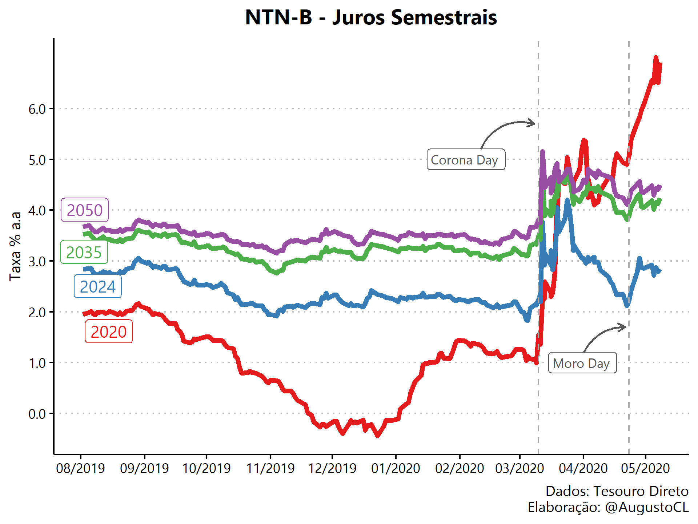
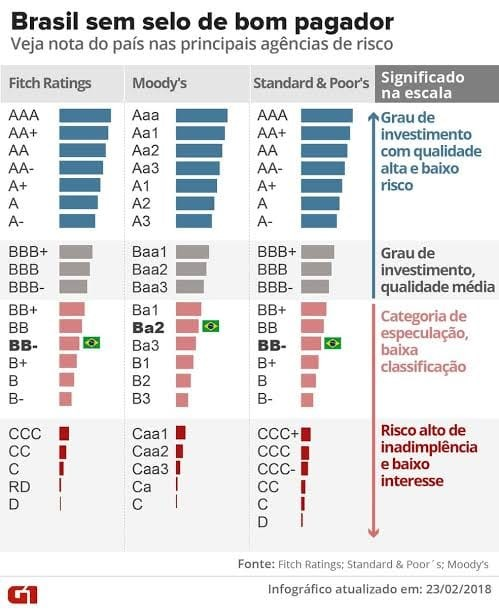
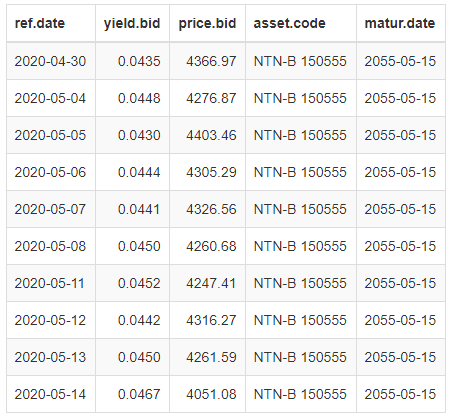
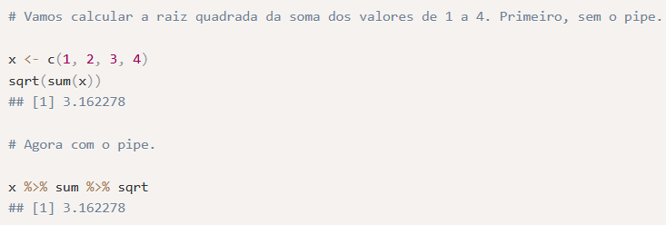
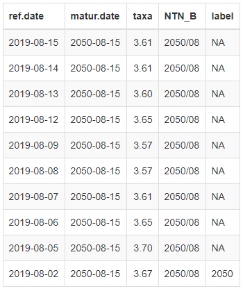
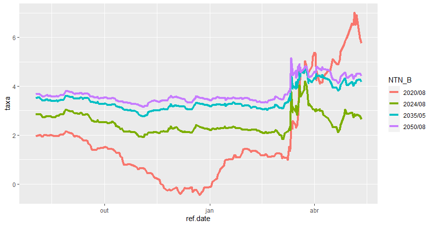
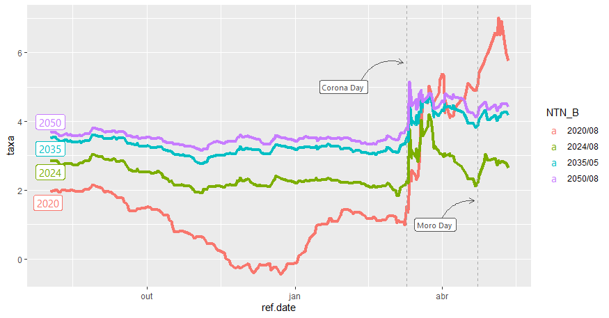
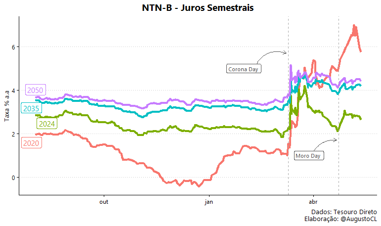

O caso de hoje é uma análise de impacto do cenário pandêmico e político no mercado de renda fixa brasileiro utilizando os dados do sistema oficial do [Tesouro Direto](https://www.tesourodireto.com.br/) (TD).\
Para isso, utilizaremos a linguagem R tanto para a extração e tratamento dos dados, quanto para a geração da visualização final. No decorrer do artigo, irei detalhar todo o [código](https://github.com/AugustoCL/NTN-B_ggplot2/blob/master/ntnbs.R) utilizado, para que no futuro você possa gerar suas próprias análises de títulos públicos com os dados do Tesouro Direto e a linguagem R. \
Aqui cabe um adendo importante, para a extração dos dados do TD eu utilizei o pacote [GetTDData](https://cran.r-project.org/web/packages/GetTDData/vignettes/gtdd-vignette_GetTDData.html) produzido pelo Professor da UFRGS [Marcelo S. Perlin](https://www.msperlin.com/blog/). Ele também produziu outros pacotes relevantes para a análise de finanças quantitativas e, caso tenha interesse no assunto, eu recomendo muito que depois vasculhe os demais pacotes e conteúdos produzidos pelo professor.

### Objetivo Final
Esta é a visualização final que iremos recriar no decorrer do artigo, nela temos as taxas de compra de títulos públicos indexadas à inflação (IPCA), as famosas NTN-B, de diferentes vencimentos entre o período de 08/2019 e 05/2020. Através dela, observamos o impacto do atual cenário pandêmico nas NTN-Bs, onde destaco o início do stress ocasionado pelo COVID19 em março e, também, o stress político e institucional gerado pela saída de Sérgio Moro do Ministério da Justiça em abril de 2020.



Para aqueles que não possuem familiaridade com títulos públicos, uma rápida intuição para a interpretação das taxas seria a seguinte: quanto maior o risco de default (calote) de um país, maior a taxa de juro exigida pelo mercado para que justifique o investimento naquele título.

Um exemplo claro deste fundamento são as notas de investimento (rating de crédito) que agências de crédito como Fitch Ratings, Moody's e Standard & Poor's fornecem para cada país, após analisarem o cenário macroeconômico, político e da dívida pública, por exemplo. A título de curiosidade, segue uma visualização do G1 que explicita as diferentes classificações de ratings e seus significados. A visualização é de 2018, quando o Brasil perdeu o grau de investimento, mas mesmo defasada é extremamente útil para fortalecer o entendimento do risco-país.



Enfim, vamos ao código!

### 1.	Instalando pacotes e dependências

Utilizaremos os seguintes pacotes: \
- __`Tidyverse`__: carrega um conjunto de pacotes utilizados em todo o workflow de datascience no R. Para o nosso caso, utilizaremos os pacotes de manipulação dos dados e geração de gráficos. \
- __`ggthemes`__: carrega diferentes temas de gráficos para customizarmos nossa visualização. \
- __`GetTDData`__: pacote responsável pela extração dos dados do Tesouro Direto (TD). \
- __`extrafont`__: carrega um conjunto de fontes disponíveis para a customização da visualização. \
- __`ggrepel`__: pacote que ajusta os rótulos dos dados automaticamente para que nenhum rótulo sobreponha outro rótulo \

Caso você não possua algum deles já instalados em sua máquina, será necessário instalar os pacotes faltantes da seguinte forma:
```{r eval=FALSE, include=TRUE}
install.packages(c("tidyverse","ggthemes","GetTDData","extrafont","ggrepel"))
```

Em seguida, carregamos todos os pacotes e selecionamos a fonte que será utilizada para o nosso gráfico final (Lembrando que a fonte pode ser alterada para qualquer outra de sua escolha).\
```{r eval=FALSE, include=TRUE}
library(tidyverse)
library(ggthemes)
library(GetTDData)
library(extrafont)
library(ggrepel)
font_import()
loadfonts(device = "win")
custom_font <- "Gadugi"
```
\
A função __`font_import()`__  faz o download de um conjunto de fontes, a função __`loadfonts(device= “win”)`__ carrega as fontes baixadas para estarem disponíveis no R e o comando __`custom_font <- “Gadugi”`__ atribui à variável __`custom_font`__ o nome da fonte **Gadugi** que será utilizada em toda visualização.

> Dica: Para selecionar a fonte desejada use o comando fonts() apresenta no terminal o nome de todas as fontes carregadas pelos comandos anteriores. \

### 2.	Carregando os dados do Tesouro Direto
```{r eval=FALSE, include=TRUE}
# download data
download.TD.data(asset.codes = "NTN-B")
NTNB <- read.TD.files(asset.codes = "NTN-B")
```
 \
Após o carregamento dos pacotes, a função __`download.TD.data()`__ efetua o download do histórico do sistema oficial do Tesouro e salva todos os arquivos dentro de uma pasta chamada “TD Files”. Em seguida, a função __`read.TD.files()`__ procura a pasta “TD Files” dentro do seu diretório atual e lê todos os arquivos dentro dela, de acordo com o argumento buscado “NTN-B”.

> Dicas: \
> - Para consultar seu diretório atual, execute o comando getwd() e, para selecionar o diretório de sua escolha, digite o atalho CTRL + SHIFT + H. \
> - Para a seleção de múltiplos títulos é necessário inserir um vetor com os títulos no argumento das funções. `assets <- c(“NTN-B”, “LTN”, “NTN-C”)`. \

Com o comando __`tail(NTNB, 10)`__ é possível conferir rapidamente os 10 últimos dados da base extraida do TD. 
A base contém a data de referência (diária), o valor da taxa de compra do título, o preço de compra, o nome do título e a data de vencimento. 



### 3.	Tratando os dados

**Introdução ao Operador Pipe (%>%)**

Antes de começarmos os tratamentos dos dados, vou introduzir rapidamente o conceito do operador pipe, pois, além de ser utilizado no nosso código, ele possui vantagens na leitura de código e é amplamente utilizado na comunidade R, e você poderá se deparar com ele novamente. Para isso, eu peguei emprestado um exemplo do [tutorial da curso-R](http://material.curso-r.com/pipe/) que apresenta um caso simples e de rápido entendimento do uso do operador.



Em resumo, o operador pipe acumula o resultado da operação à esquerda do operador e aplica o resultado à função à direita do operador. Desta forma, é possível encadear diferentes ações que ocorrem em uma única base de dados, em uma única sequência de código altamente legível.

**Voltando aos filtros**

Como nosso objetivo é avaliar o impacto dos acontecimentos ocorridos em março/20 e abril/20 no mercado de títulos, devemos aplicar alguns filtros para prosseguirmos a análise.

Iremos selecionar **(i)** as negociações que ocorreram no intervalo de Outubro/2019 a Maio/2020, **(ii)** os títulos NTN-B com pagamentos de juros semestrais para isolar a diferença de taxa entre títulos com e sem cupom e, por fim, **(iii)** selecionar alguns vencimentos específicos para não poluirmos a visualização e conseguirmos avaliar o impacto em diferentes maturidades.
```{r eval=FALSE, include=TRUE}
# wrangle the data
NTNB %>% 
  filter(matur.date %in% venc_ntnbs,
         ref.date > as.Date("2019-08-01"), 
         !str_detect(asset.code,"Principal")) %>%  
  mutate(taxa = yield.bid*100,
         NTN_B = format(matur.date, "%Y/%m"),
         label = if_else(ref.date == min(ref.date),
                         format(matur.date, "%Y"),
                         NA_character_)) %>%
  arrange(NTN_B,desc(ref.date), .by_group = TRUE) %>%
  select(-c(yield.bid, asset.code, price.bid)) %>%
```
\

Criamos um vetor venc_ntnbs com os vencimentos selecionados em 2020, 2024, 2035 e 2050 onde iremos filtrar vencimentos. 

Em seguida, filtramos as observações cuja variável **matur.date** é a mesma que algum dos vencimentos selecionados no vetor venc_ntnbs. Para isso, utilizamos o operador __`%in%`__ dentro da função __`filter`__. O segundo filtro seleciona observações cuja variável de negociação **ref.date** é menor que a data 2019-08-01. O último filtro seleciona observações que não possuem o texto “Principal” na variável **asset.code**. 

Com a função mutate podemos criar diversas variáveis de uma única vez rapidamente. Primeiro multiplicamos a coluna **yield.bid** por 100 para uma melhor visualização no gráfico, depois criamos a variável **NTN_B** contendo o ano e o mês do vencimento no formato (AAAA/MM) e por último utilizamos uma condição com a função __`if_else()`__ para criar a variável **label**, contendo o ano do vencimento na primeira observação e contendo NA nas demais observações para criarmos o rótulo do vencimento no gráfico.

Por fim, a função __`arrange()`__ ordena a tabela através das variáveis **NTN_B** e **ref.date** e retiramos as colunas **yield.bid**, **asset.code** e **price.bid** com a função __`select()`__. Segue abaixo o output do comando __`tail(NTNB, 10)`__.



### 4.	Construindo a visualização

Agora entraremos na parte mais complexa do código devido ao uso de inúmeras funções distintas, com cada uma delas contendo vários argumentos. Como seria inviável explicar item por item, vou passar uma visão geral sobre quais são as funções que geram os principais elementos do nosso gráfico final, dando insumos para que você encontre as respostas de dúvidas futuras sobre o código completo nas documentações das funções. Além disso, dúvidas e/ou sugestões nos comentários também são bem vindas. =]

Inicialmente, somente estas duas linhas do pacote __`ggplot2`__ contido no pacote __`tidyverse`__ são capazes de gerar nosso gráfico. Porém, apesar da visualização ser esclarecedora, ela não é nem um pouco atrativa esteticamente.  
```{r eval=FALSE, include=TRUE}
# continuando do pipe acima, temos:
ggplot(aes(x = ref.date, y =  taxa, color = NTN_B)) +
geom_line(size = 1.5) +
```



Para melhorar esteticamente nossa visualização, precisamos customizar os elementos do gráfico como um todo, ajustar nomes de eixos e títulos, adicionar créditos e fonte, substituir a legenda por rótulos dentro do gráfico com apenas o ano de vencimento e, por fim, indicar os períodos de destaque através de linhas, setas e rótulos.  

Pois bem, começando com os destaques da nossa análise, utilizei a função __`geom_vline()`__ para criar as linhas verticais para cada um dos dias, a função __`geom_label()`__ para criar os rótulos com os textos “Corona Day” e “Moro Day” e a função __`geom_curve()`__ para criar as curvas que ligam os rótulos às linhas verticais. Para todas as funções é necessário indicar, através dos argumentos, as posições dos elementos nos eixos, junto com cores e elementos específicos. Adicionalmente, utilizei a função __`geom_label_repel()`__ do pacote __`ggrepel`__ para criar os rótulos com o vencimento de cada título. 



Em seguida, renomeei eixos e títulos, adicionei crédito e fonte através de funções como __`ggtitle()`__, __`xlab()`__, __`ylab()`__ e __`caption()`__. Também adicionei um tema de gráfico, conforme o meu gosto pessoal utilizando o padrão __`theme_clean()`__ do pacote __`ggthemes`__. Além disso, foi necessário fazer alguns ajustes internos ao tema escolhido utilizando a função __`theme()`__, como excluir a legenda que não era mais necessária e centralizar o título.

*Dicas:*
*(i) Faça testes utilizando diferentes temas do pacote ggplot2 e também do ggthemes para você descobrir diversos temas de gráfico que podem agradar você.*
*ii) Fazendo ajustes dentro da função theme() é possível customizar QUALQUER elemento do seu gráfico.*



Por fim, escolhi uma paleta de cores diferente com a função __`scale_color_brewer()`__ e fiz ajustes nas escalas de data e taxa com as funções __`scale_x_date()`__ e __`scale_y_continuous()`__, ajustando formato de data e decimal da taxa. Após isso, utilizei a função __`ggsave()`__ para adicionar as dime nsões desejadas para o gráfico, resultando na nossa visualização final.


Caso deseje baixar e reproduzir o código completo, acesse esse [link](https://github.com/AugustoCL/NTN-B_ggplot2/blob/master/ntnbs.R) no github.