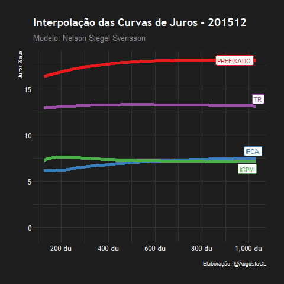
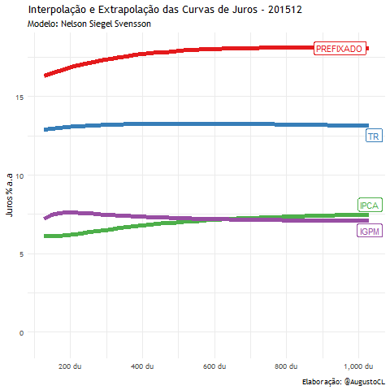
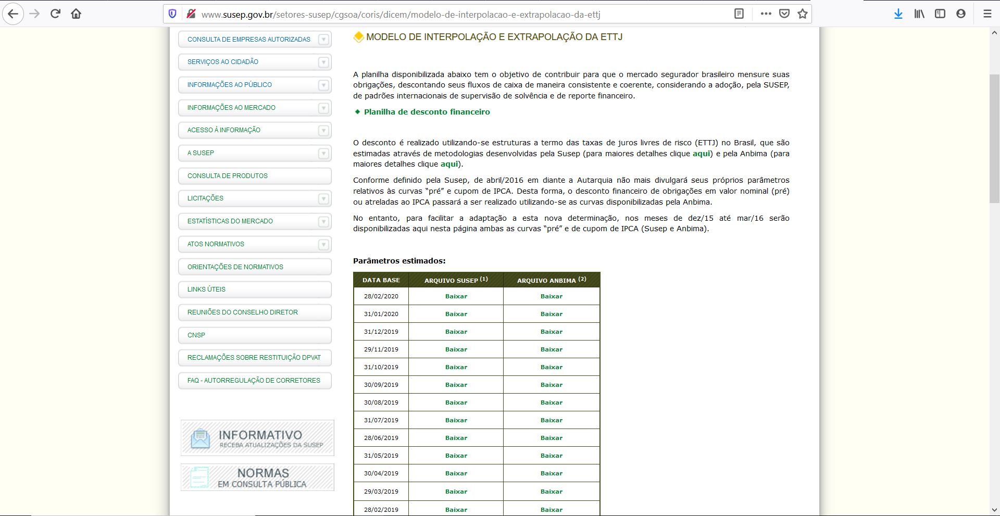

Esse projeto utiliza o modelo de curvas de juros *NelsonSiegelSvensson*, que é utilizado pela SUSEP, ANBIMA e diversos Bancos Centrais pelo mundo, para a gerar:
- O histórico das curvas de juros futuras **pré**, **ipca**, **igpm** e **tr** extraídas diretamente do site da SUSEP via Webscraping.
- Uma visualização animada (gif) do comportamento histórico de cada uma das curvas.

[Códigos disponíveis do projeto](https://github.com/AugustoCL/ETTJ_SUSEP)

### Ferramentas utilizadas
- __[Python]__ para o __webscraping__ que automatiza a coleta dos dados e aplica o modelo da curva de juros. 
- __[R]__ que efetua a limpeza, tratamento e a criação do **gif** final.

### Breve Descrição dos Códigos
O script .py extrai todos os parâmetros mensais disponibilizados no site da [SUSEP](http://www.susep.gov.br/setores-susep/cgsoa/coris/dicem/modelo-de-interpolacao-e-extrapolacao-da-ettj), efetua o tratamento dos dados para a saída de uma tabela estruturada, e utiliza os parâmetros para a geração de todas as curvas futuras, gerando o output final em .xlsx \
O script .R trata os dados em .xlsx e gera a animação .gif com o histórico das 4 curvas na mesma visualização.

