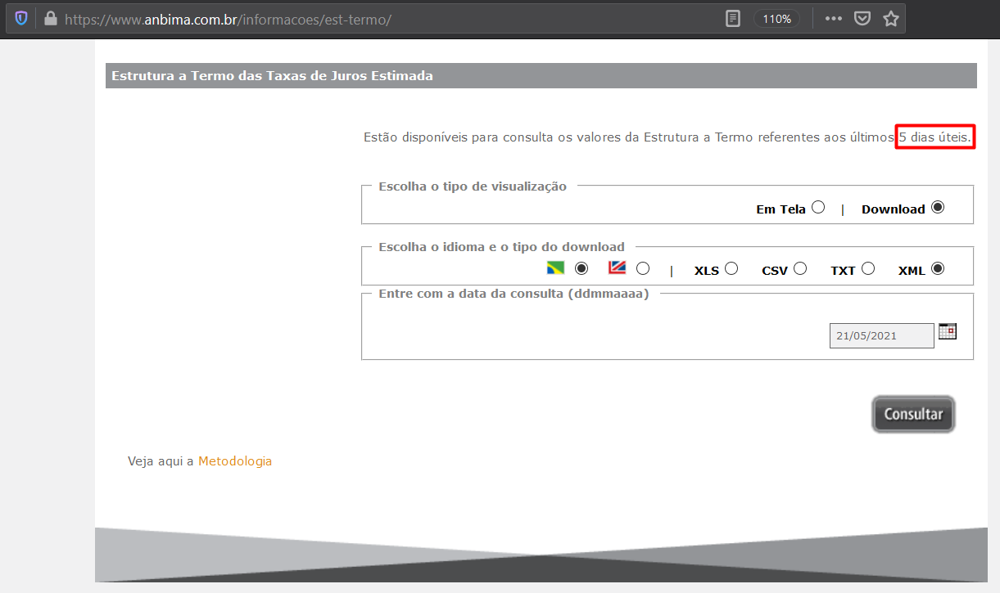
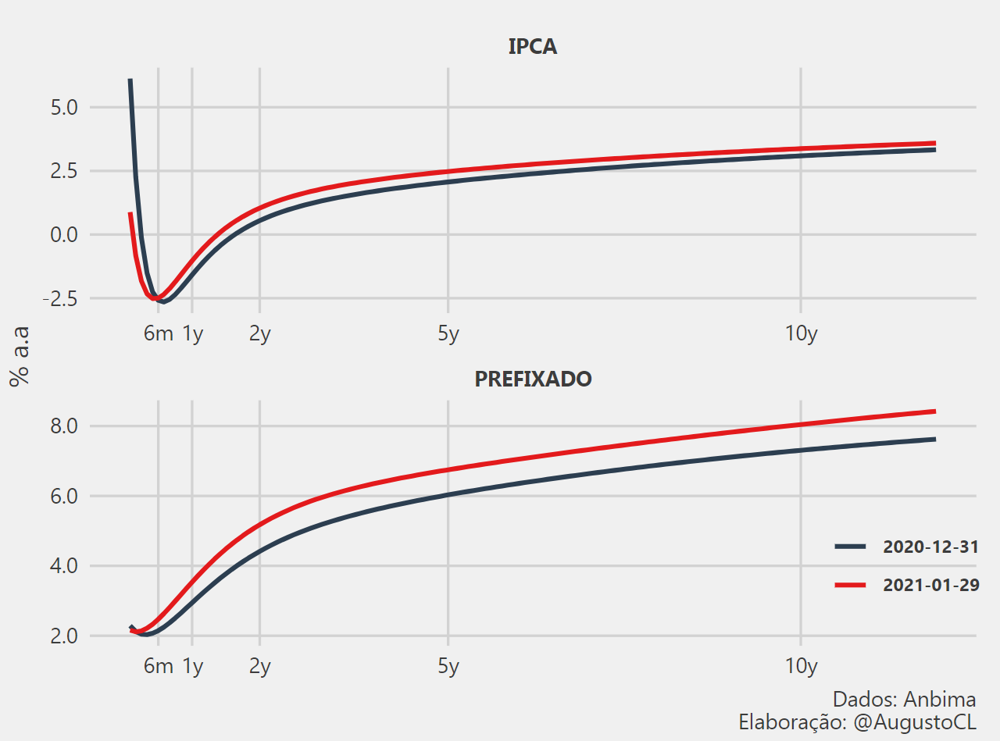
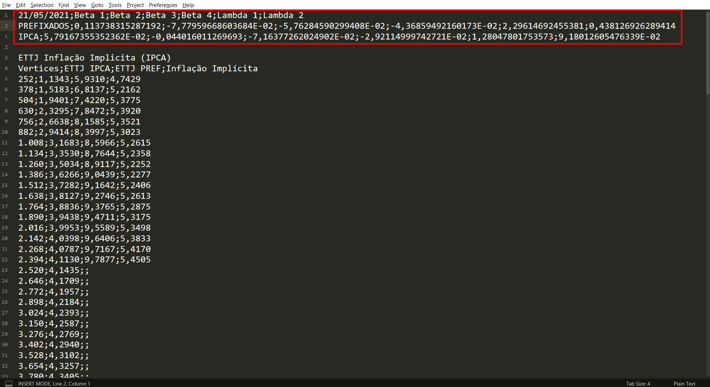
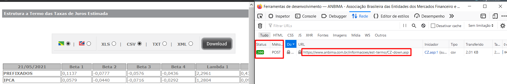
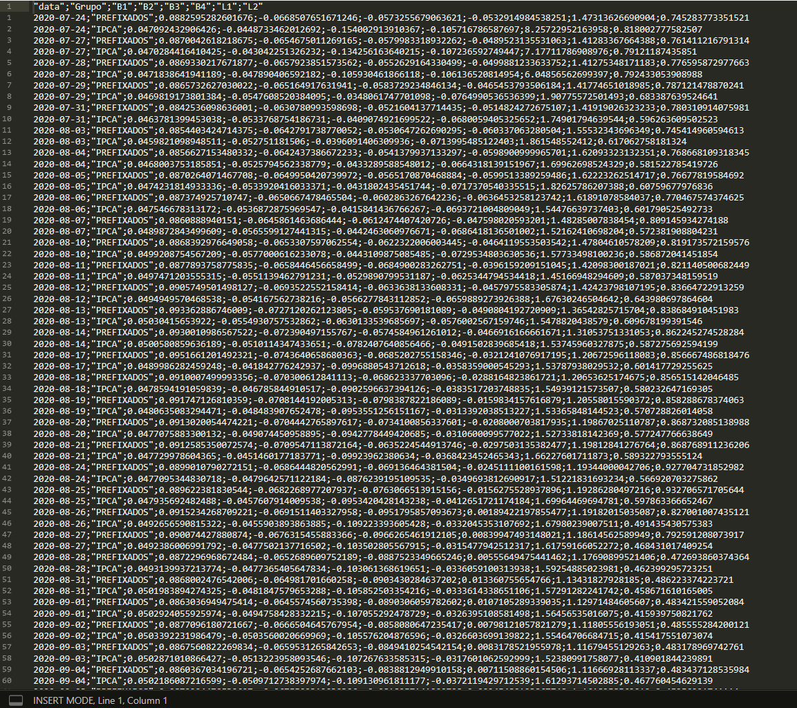

```{r setup, include=FALSE}
knitr::opts_chunk$set(echo = TRUE, comment = NA)
library(tidyverse)
library(bizdays)
library(httr)
```

Neste post vou ensinar como criar um script de webscraping com R e como automatizar a execução deste script com o __`task scheduler`__ do Windows. Com isso, teremos um arquivo __`.csv`__ que recebe novos dados a cada execução semanal.

## 1 - Por que capturar estes dados?
A ANBIMA disponibiliza nesta [página](https://www.anbima.com.br/informacoes/est-termo/) a estimação diária da estrutura a termo das taxas de juros (ETTJ), porém o site só permite o acesso a dados de **até os últimos 5 dias úteis**, conforme imagem abaixo.


Então como nem todos possuem acesso a um terminal [Bloomberg](https://www.bloomberg.com.br/) para ter acesso a estes dados diários, eu resolvi criar uma base própria usando um script que é executado semanalmente.  

## 2 - O que são e para que servem estes dados?
A estimação diária da Estrutura a Termo das Taxas de Juros (ETTJ) é feita com os parâmetros da curva de juros disponibilizada na ANBIMA. Com estes dados (parâmetros do modelo) é possível gerar diferentes curvas de juros para as minhas análises de cenário de renda fixa. Abaixo há um exemplo de análise comparativa das curvas de juros entre dois períodos que eu executo com os dados.



> No próximo post irei ensinar como criei uma função que gera esse gráfico comparativo a partir do input de duas datas. Por agora, tenho um post aqui no site com um _gif_ que mostra o histórico dessas curvas de juros que pode ser visto [aqui](../2021-04-30-curva-juros/). Os códigos completos para você reproduzir também estão disponíveis lá no github.

O site permite baixar os dados em diferentes formatos e nesse caso irei utilizar o formato __`.csv`__. Abrindo no Sublime Text, temos a seguinte estrutura do arquivo com destaque na imagem para os parâmetros que serão coletados. 


## 3 - Criando o script R

### 3.1 - Extração dos parâmetros via webscraping da ANBIMA
Quando investigamos o funcionamento do site, usando as ferramentas de desenvolvedor do navegador, verifica-se uma requisição POST que retorna os dados no formato solicitado. Abaixo há as imagens em sequência destacando os pontos de identificação da requisição.



Quando avaliamos a requisição post, encontramos os dados que precisam ser inputados para a requisição POST retornar o que desejamos. Com eles iremos automatizar a requisição via script.


### 3.2 - Reproduzindo a requisição via script R

Irei abordar o passo a passo da requisição e limpeza dos dados e, em seguida, encapsularei tudo em uma função para poder iterar este processo nos 5 dias úteis disponíveis usando o pacote __`purrr`__.

Com o pacote __`httr`__ é possível reproduzir a requisição post passando:

* A url em texto no argumento __`url`__.
* Um objeto __`list`__ no argumento __`body`__ com todos os dados da requisição que vimos anteriormente.
* A string "form" para o argumento __`encode`__ para identificar que a requisição tem a estrutura de formulário.
```{r echo=TRUE, message=FALSE, warning=FALSE}
url <- "https://www.anbima.com.br/informacoes/est-termo/CZ-down.asp"

dt = "21/05/2021"

r <- httr::POST(url = url,
                body = list(Idioma = "PT",
                            Dt_Ref = dt,
                            saida = "csv"),
                encode = "form")
r
```


### 3.3 - Faxinando o dado 
Como a requisição possui status __`200`__, sabemos que foi bem sucedida. Agora podemos conferir o conteúdo com a função __`content()`__. Com o argumento __`as =`__ a função permite interpretar o resultado como texto puro 'text' ou binário 'raw'. Com os teste que fiz, o mais indicado é ler o output como binário e então converter o binário em texto usando a função __`RawToChar()`__.
```{r}
texto_puro <- rawToChar(content(r, as = "raw"))
```

Com isso, podemos passar o texto puro para a função __`read_csv2()`__ que irá gerar o dataframe com os dados desejados. Como o texto já está configurado com notaçao científica, a função já entende que os dados são numéricos e interpreta eles corretamente.

Mas antes de passar na função, lembrem-se da imagem do arquivo .csv no sublime text, com ela vemos que é necessário lermos somente as 3 primeiras linhas do texto (1 cabeçalho + 2 observações). Então passaremos essa condição no argumento __`n_max`__, iremos ajustar o nome das colunas e adicionar uma columa com a data. Tudo em uma sequência de pipe.

```{r message=FALSE, warning=FALSE}
dados <- 
        read_csv2(texto_puro, n_max = 2) %>% 
        `colnames<-`(c("Grupo","B1","B2","B3","B4","L1","L2")) %>% 
        mutate(data = dt)

glimpse(dados)
```

### 3.4 - Encapsulando em uma função

Agora podemos criar uma função que recebe a data e retorna o nosso datafame desejado. Nesse caso precisamos generalizar o argumento de data no nosso código usando a função __`format(dt, "%d/%m/%Y")`__ no argumento da requisição POST e também na coluna de data que adicionamos no dataframe __`mutate(data = dt)`__. A função final fica dessa forma: 
```{r echo=TRUE, message=FALSE, warning=FALSE}
get_ettj_param <- function(dt){
    
    url <- "https://www.anbima.com.br/informacoes/est-termo/CZ-down.asp"
    
    r <- httr::POST(url = url,
                    body = list(Idioma = "PT",
                                Dt_Ref = format(dt, "%d/%m/%Y"),
                                saida = "csv"),
                    encode = "form")
    
    texto_puro <- rawToChar(content(r,as = "raw"))
    
    dados <- 
        read_csv2(texto_puro, n_max = 2) %>% 
        `colnames<-`(c("Grupo","B1","B2","B3","B4","L1","L2")) %>% 
        mutate(data = dt)
    
    return(dados)    
}
```

### 3.5 - Obtendo o vetor de dias úteis com o __`bizdays`__
Para iterar as datas precisamos criar um vetor com os últimos 5 dias úteis. Felizmente o pacote __`bizdays`__ nos permite selecionar os últimos 5 dias úteis independente do dia que vc executar o script. 

```{r}
# load the working days by calendar of anbima
data(holidaysANBIMA, 
     package = 'bizdays')
cal <- create.calendar(holidaysANBIMA, 
                       weekdays=c('saturday', 'sunday'),
                       name='ANBIMA')
d2 = Sys.Date()
d1 = add.bizdays(d2, -6, cal = cal)
data_seq <- bizseq(d1, d2, cal)
data_seq
```
Primeiro carregamos o calendário da ANBIMA, já disponível no pacote, carregando o calendário na variável __`cal`__. Em seguida, criamos o dia atual com a função __`Sys.Date()`__ e com as funções do pacote __`bizdays`__ obtemos o sexto dia útil anterior para obtermos o vetor de 5 dias úteis completo. 

### 3.6 - Iterando a função em múltiplas datas com o __`purrr`__
O __`purrr`__ permite adotarmos o paradigma de programação funcional permitindo que eliminemos for loops do nosso código utilizando funções como o __`map()`__. Além disso ele possui variações como o __`map_dfr()`__ que além de iterar o vetor de input na função desejada, ele já executa o empilhamento dos dados, retornando um data frame completo.
```{r message=FALSE, warning=FALSE}
deal_error <- 
    purrr::possibly(get_ettj_param, 
                    otherwise = NA_real_) # deal with error
result <- 
    purrr::map_dfr(data_seq[1:6], deal_error) %>% 
    select(data, everything())

glimpse(result)
```
Nesse caso eu também utilizo o __`possibily()`__ para lidar com possíveis erros em alguma iteração do map. Com ela, caso ocorra um erro em uma iteração, o map não vai parar de iterar, ele irá inputar NA nos dados que falharam e continuará a execuçao do próximo item.

### 3.7 - Salvando os dados em um __`.csv`__
Para finalizar o script, precisamos criar uma condição que verifica se o arquivo .csv já existe. Caso exista, ele irá adicionar os novos dados ao arquivo, caso contrário, irá criar um novo arquivo com os dados capturados.
```{r echo=TRUE, results='hide'}
name_db <- "hist_coef_pre_ipca.csv"

if (file.exists(name_db)){
    datas_unicas <- unique(as.Date(read.csv2(name_db,header = 1)$data, "%Y-%m-%d"))
    
    result <- result %>% filter(!data %in% datas_unicas)
    
    write.table(result,
                file =  name_db,
                append = TRUE,
                row.names = FALSE,
                col.names = FALSE,
                sep = ";", 
                fileEncoding = "UTF-8")
} else {
    write.table(result, 
                file =  name_db,
                append = FALSE,
                row.names = FALSE,
                sep = ";", 
                fileEncoding = "UTF-8")
}
```

## 4 - Agendando a execução do script
Com o script pronto, podemos agendar a execução do scraper usando um script __`.bat`__ que executa via linha de comando o script R.

O script .bat fica dessa forma
```{bat}
"C:\Program Files\R\R-4.0.2\bin\R.exe" CMD BATCH C:\Users\augus\Documents\dev_R\schedule_R\coef_curv_anbima_scheduler.R
```
Nele é passado o executável do R na string inicial, depois o comando __`CMD BATCH`__ chama a linha de comando que será executado o script R que vem logo em seguida.

A partir desse simples código o __`TaskScheduler`__ do Windows irá agendar a execução do script e assim toda semana sua base irá receber os dados da semana anterior.

Para não prolongar ainda mais este post, deixo aqui um [tutorial](https://www.softdownload.com.br/como-automatizar-execucao-de-programas.html) de como agendar tarefas com essa ferramenta. Basta seguir estes passos e selecionar o script .bat como programa (script) a ser executado.

> Para os usuários de Linux é possível usar o __`crontab`__ para fazer o mesmo agendamento. 
> Essa estrutura permite executar scripts de diferentes linguagens. Caso queira agendar um script python, basta usar o caminho do executável do python e referenciar o script .py que deseja.

No meu caso, agendo o script para que seja executado toda segunda-feira para capturar. Então como eu criei o script em Julho/2020 eu tenho dados desde esse período no meu arquivo .csv.



Por fim, o script R que utilizo se encontra no seguinte [gist](https://gist.github.com/AugustoCL/866b568efbebff538f198986fec22ef7) do github. 
No próximo post irei detalhar o script R que executa o plot apresentado no início do artigo.
