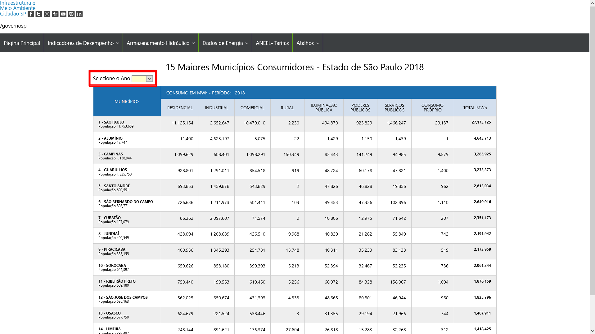
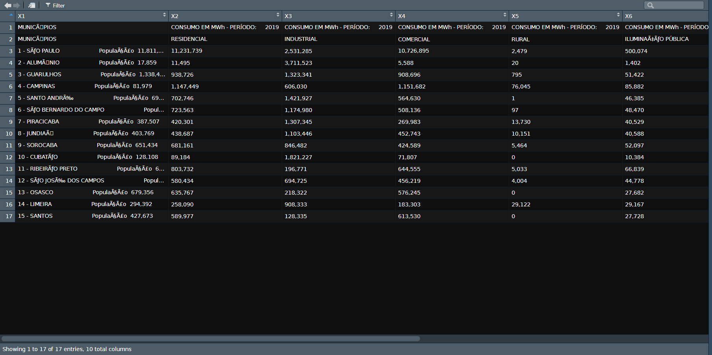
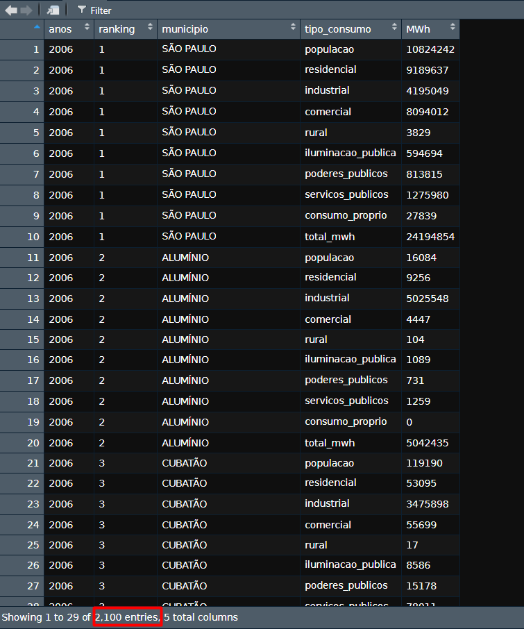
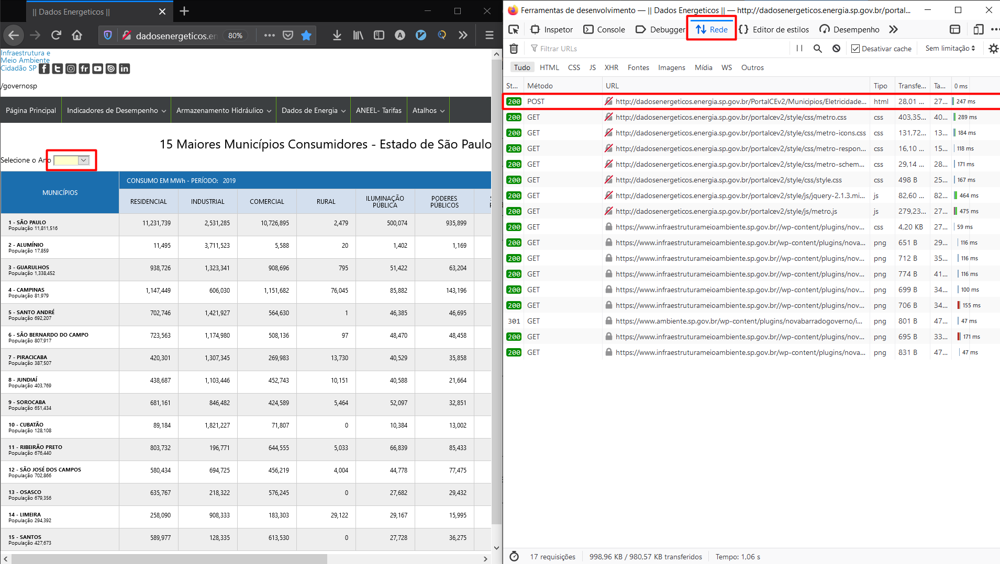
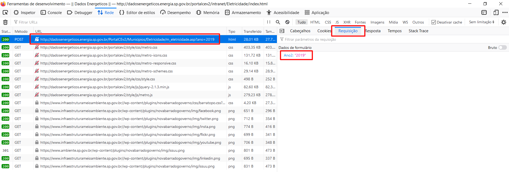
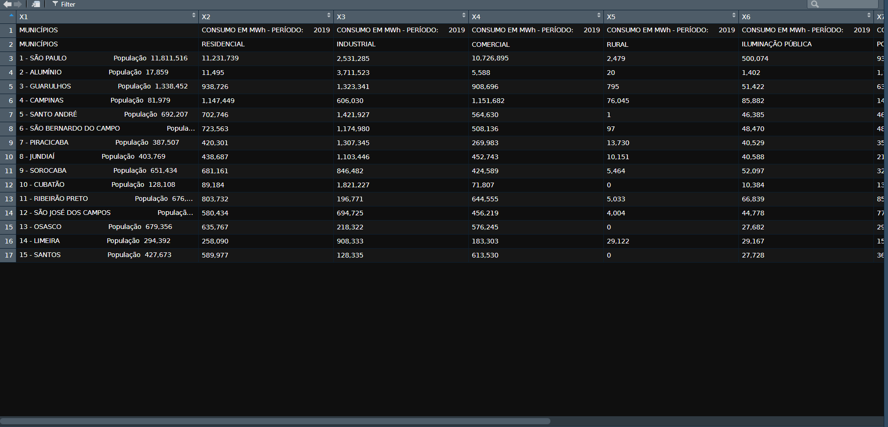
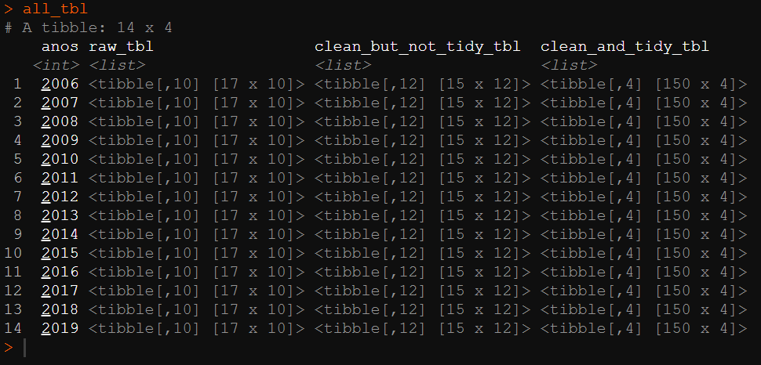
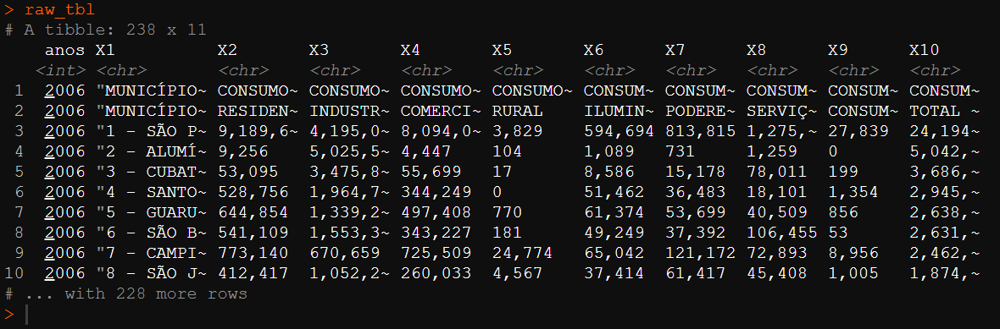
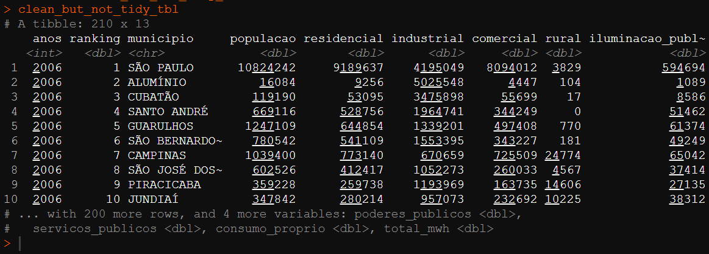
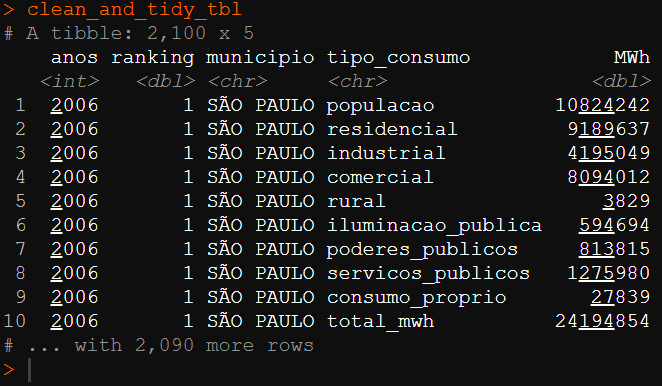

```{r include=FALSE}
scrapy_consumo_eletr_ano <- function(ano){

    # requisicao POST
    aaaa <- ano
    url <- "http://dadosenergeticos.energia.sp.gov.br/PortalCEv2/Municipios/Eletricidade/m_eletricidade.asp?ano={aaaa}"
    req <- httr::POST(url = glue::glue(url),
                      body = list(Ano2 = aaaa),
                      encode = "form")

    # converte o binario do html para string
    raw_html <- rawToChar(req$content) %>%
      str_replace_all(., "Ã\u008d", "Í") %>%
      str_replace_all(., "ÇÃ", "ÇÃ") %>%
      str_replace_all(., "Ã", "Ã") %>%
      str_replace_all(., "É", "É") %>%
      str_replace_all(., "çã", "çã")

    # usando regex, extrai o bloco de código equivalente a tabela do html
    text_inside_html_table <-
        gsub('^.*<table\\s*|\\s* <\\/table>*$', '', raw_html) %>%
        paste0("<table ", .)

    # converte o html da tabela em dataframe
    dirty_tibble <- text_inside_html_table %>%
        read_html() %>%
        html_table() %>%
        pluck() %>%
        as.data.frame() %>%
        as_tibble()
}

# Função de Limpeza da Base -----------------------------------------------

clean_table <- function(tbl){

  tbl %>%
    slice(-1) %>%
    janitor::row_to_names(row_number = 1) %>%
    janitor::clean_names() %>%
    rename(total_mwh = total_m_wh) %>%
    separate(col = "municipios",
             sep = "População",
             into = c("municipio", "populacao")) %>%
    separate(col = "municipio",
             sep = " - ",
             into = c("ranking", "municipio")) %>%
    mutate(
      across(ranking:populacao,
             ~str_squish(.)),
      across(c(ranking, populacao:total_mwh),
             ~as.numeric(str_replace_all(., ",", "")))
      )
}
```


```{r setup, include=FALSE}
knitr::opts_chunk$set(echo = TRUE)
library(tidyverse)
library(httr)
library(rvest)
library(janitor)

devtools::source_gist("c83e078bf8c81b035e32c3fc0cf04ee8", 
                      filename = 'render_toc.R')
```

Este post detalha o trabalho final realizado para a conclusão do curso [Faxina de Dados](https://curso-r.com/cursos/faxina/) da [Curso-R](https://curso-r.com/), onde foi solicitado que o trabalho tenha __no mínimo__:

* Leitura de uma base bruta que não esteja no formato _tidy_, em que cada variável é uma coluna e cada linha é uma observação.
* Manipulação alguma coluna de texto.
* Que seja salvo a base no formato _tidy_, na extensão _.rds_.

> Caso queiram conferir o código final, sem precisar conferir todo o passo-a-passo abaixo, aqui está o [link](https://gist.github.com/AugustoCL/af32c55c15d0113f0451f3d79895c5ee) do script completo.


__Índice__

```{r echo=FALSE}
render_toc("index.Rmd",toc_header_name = NULL)
```


## 1 - Resumo do Caso
Como encontrei muitas bases públicas relativamente limpas, fui atrás de bases que necessitavam de uma boa limpeza e assim me animei para executar um webscraping para obter os dados sujos.

> Eu aproveitei também para encapsular todo o processo em funções do `purrr`, trabalhando com as column-lists do universo Tidyverse. Isso permitiu tornar o código mais legível e reprodutível, além de diminuir as linhas de código ao evitar o uso de for-loops.

Então capturei os valores de consumo de energia em MWh dos 15 maiores munícipios consumidores de energia do estado de São Paulo, por ano, que estão disponíveis na seguinte [página](http://dadosenergeticos.energia.sp.gov.br/portalcev2/intranet/Eletricidade/index.html) da Secretaria de Infraestrutura e Meio Ambiente de SP.



No retângulo vermelho destacado na imagem há uma caixa de seleção do ano dessa tabela que possui informações de 2006 até 2019. Portanto a base completa possui cerca de 210 observações (14x15).

Esta base pode ser considerada _untidy_ pois temos várias colunas que representam a mesma informação do tipo de consumo. Então para transformarmos a base no formato _tidy_ é necessário que essas colunas sejam transformadas em uma única variável chamada "tipo_consumo".

### 1.1 - Base Suja Untidy
A extração crua do webscraping gera a seguinte base suja com problemas de encoding.  



### 1.2 - Base Limpa Tidy 
Após o webscraping, limpeza e tratamento dos dados, obtemos a seguinte base final no formato _tidy_ solicitado.




## 2 - Executando o webscraping

### 2.1 - Identificando a requisicao no site
Quando abrimos a seção de rede da ferramenta de desenvolvedor do navegador e selecionamos um novo ano da tabela, é possível identificar a requisição POST que retorna o html da página que contém a tabela.



Ao investigar essa requisição é possível extrair a url solicitada e os campos do formulário necessários.



### 2.2 - Recriando a requisicao via script (httr, rvest, stringr)
Com as informações em mão, conseguimos reproduzir a mesma requisição via código da seguinte forma.
```{r}
aaaa <- 2019
url <- "http://dadosenergeticos.energia.sp.gov.br/PortalCEv2/Municipios/Eletricidade/m_eletricidade.asp?ano={aaaa}"
req <- httr::POST(url = glue::glue(url),
                  body = list(Ano2 = aaaa),
                  encode = "form")
```

O resultado é uma lista com várias informações da requisição, em que o conteúdo principal está no formato binário. Então usamos a fução `rawToChar()` para transformar o binário em texto obtendo assim todo o html da página.
```{r}
raw_html <- rawToChar(req$content)
```

Dentro do html existe a tag `<table>` que contém todos os dados que necessitamos, mas precisamos selecionar somente o texto desta tag para conseguirmos avançar com a leitura da tabela. Para isso apliquei uma expressão regex que seleciona todo o texto entre as tags `<table` e `</table>` na função `gsub()`. Em seguida, adicionei a string o termo `<table ` que não foi capturado pela função anterior. Desse modo, conseguimos obter uma string html que é reconhece uma tabela com a função `html_table()`

```{r}
text_inside_html_table <-
  gsub('^.*<table\\s*|\\s* <\\/table>*$', '', raw_html) %>%
  paste0("<table ", .)
```

Em seguida apliquei as funções `read_html()` e `html_table()` do pacote `rvest`, extrai a tabela com o `pluck()` e converti em um dataframe, resultando na tabela suja apresentada na introdução do problema.
```{r}
dirty_tibble <- text_inside_html_table %>%
  rvest::read_html() %>%
  rvest::html_table() %>%
  purrr::pluck() %>% 
  base::as.data.frame() %>%
  dplyr::as_tibble()

glimpse(dirty_tibble)
```

### 2.3 - Solucionando os encodings (stringr)
Observando o texto html da variável `raw_html`, percebi que já havia esses problemas de encoding. Usei a função `guess_encoding()` e descobri que o encoding era o clássico UTF-8. Testei diferentes funções de conversões de encoding que encontrei na internet, mas nenhuma funcionou. Então como eram poucos casos, resolvi fazer a substituição na mão dos casos e eu adicionei essa limpeza no código da seguinte forma. 
```{r}
raw_html <- rawToChar(req$content) %>% 
  str_replace_all(., "Ã\u008d", "Í") %>%
  str_replace_all(., "ÇÃ", "ÇÃ") %>%
  str_replace_all(., "Ã", "Ã") %>%
  str_replace_all(., "É", "É") %>%
  str_replace_all(., "çã", "çã")
```

## 3 - Limpando os dados (janitor, dplyr, tidyr, stringr)
Até o momento temos a seguinte tabela suja e _untidy_.



Prosseguindo, retirei a primeira linha que possui informações repetidas e desnecessárias, transformei a segunda linha em nome de coluna e apliquei uma limpeza dos nomes com a função `clean_names()` do pacote `janitor`.
```{r}
consumo_2019 <- scrapy_consumo_eletr_ano(2019)

consumo_2019 %>% 
  slice(-1) %>% 
  janitor::row_to_names(row_number = 1) %>% 
  janitor::clean_names() %>% 
  rename(total_mwh = total_m_wh) %>% 
  glimpse()
```

Como a variável `municipio` contém também informações do ranking e população, apliquei duas vezes a função `separate()` para transformar a variável em 3 colunas (ranking, municipio e populacao). Para isso, usei como separador as strings " - " e "População" conforme código abaixo. 
```{r, eval=FALSE}
  ... %>% 
  separate(col = "municipios",
           sep = "População",
           into = c("municipio", "populacao")) %>%
  separate(col = "municipio",
           sep = " - ",
           into = c("ranking", "municipio")) %>%
```

Após as separações, temos a seguinte base.
```{r echo=FALSE}
consumo_2019 %>% 
  slice(-1) %>% 
  janitor::row_to_names(row_number = 1) %>% 
  janitor::clean_names() %>% 
  rename(total_mwh = total_m_wh) %>% 
  separate(col = "municipios",
           sep = "População",
           into = c("municipio", "populacao")) %>%
  separate(col = "municipio",
           sep = " - ",
           into = c("ranking", "municipio")) %>% 
  glimpse()
```

Em seguida, retirei as quebras de linhas e espaços vazios com a função `srt_squish()` do pacote `stringr` que remove todas essas sujeiras tanto no início quanto no fim do texto. Depois retirei as vírgulas nas variáveis de valor e, por fim, converti essas variáveis em tipos numéricos.

```{r, eval=FALSE}
.... %>% 
  mutate(
  across(ranking:populacao,
         ~str_squish(.)),
  across(c(ranking, populacao:total_mwh),
         ~as.numeric(str_replace_all(., ",", "")))
  )
```


## 4 - Aplicando as functions em um pipeline (tidyr + purrr)
Aspirando permitir a visualização dos passos do trabalho em tabelas list-columns, separei a extração e limpeza dos dados em duas funções chamadas: 
* scrapy_consumo_eletr_ano()
* clean_table()

> Caso não possua familiaridade com a estrutura de list-columns do tidyr, sugiro que confiram este capítulo do livro da curso-R neste [link](https://livro.curso-r.com/7-3-tidyr.html#list-columns).

Desse modo, foi possível executar as iterações com a função `map()` do `purrr` e salvar todos os resultados e passos intermediários em uma única tabela agregadora chamada `all_tbl`.

```{r, eval=FALSE}
all_tbl <-
  list("anos" = c(2006:2019)) %>%
  as_tibble() %>%
  mutate(
    raw_tbl = purrr::map(anos,
                         scrapy_consumo_eletr_ano),
    clean_but_not_tidy_tbl = purrr::map(raw_tbl,
                                        clean_table),
    clean_and_tidy_tbl = purrr::map(clean_but_not_tidy_tbl,
                                    ~unnest(.) %>%
                                      pivot_longer(populacao:total_mwh,
                                                   names_to = "tipo_consumo",
                                                   values_to = "MWh")
                                    )
    )
```

Eu poderia ter aplicado a função `pivot_longer()` na função de limpeza retornando a base já no formato _tidy_, porém como eu quero demonstrar as diferentes fases do tratamento, usando o `purrr`, eu preferi recriar uma função anônima dentro do map. Assim o leitor vivência diferentes abordagens da ferramenta.

## 5.0 - Conferindo os resultados

O objeto `all_tbl` possui a seguinte estrutura com as tabelas no formato column-list. 



para extrair cada uma das tabelas intermediárias e de resultado utilizei a função unnest() da seguinte forma.

```{r, eval=FALSE}
# dados brutos
raw_tbl <-
  all_tbl %>%
  select(anos, raw_tbl) %>%
  unnest(raw_tbl)

# dados limpos, mas não tidy
clean_but_not_tidy_tbl <-
  all_tbl %>%
  select(anos, clean_but_not_tidy_tbl) %>%
  unnest(clean_but_not_tidy_tbl)

# dados limpos e tidy
clean_and_tidy_tbl <-
  all_tbl %>%
  select(anos, clean_and_tidy_tbl) %>%
  unnest(clean_and_tidy_tbl)
```

Dessa forma, conseguimos conferir as 3 fases do trabalho, com os dados brutos, os dados limpos mas untidy e os dados limpos e tidy.







Por fim, salvei os resultados em `.rds`, conforme solicitado pela atividade.
```{r, eval=FALSE}
write_rds("clean_and_tidy_tbl", clean_and_tidy_tbl)
```

