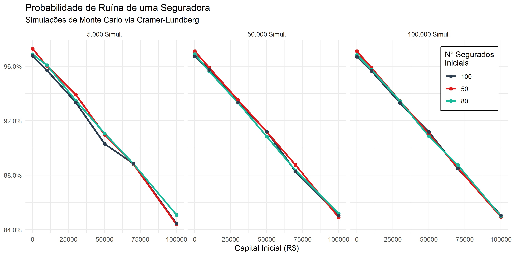
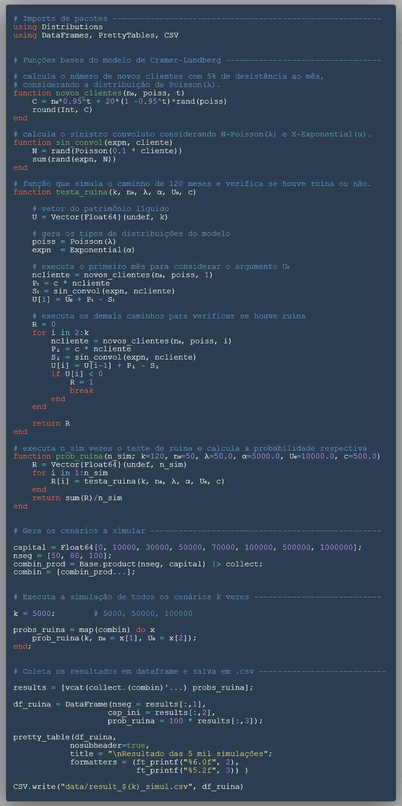

```{r setup, include=FALSE}
knitr::opts_chunk$set(echo = T, comment = ">", warning = F)

# julia engine
options(encoding = "UTF-8")
library(JuliaCall)
julia <- julia_setup()

# python engine
library(reticulate)
use_python("C:/Users/augus/AppData/Local/Programs/Python/Python38/python.exe")
```


## Introdução do problema e a linguagem Julia 

Recentemente tenho utilizado a linguagem de programação [Julia](https://julialang.org/) para problemas de simulação ou de problemas que necessitem bastante processamento computacional. Inclusive, utilizei ela no meu Trabalho de Conclusão de Curso (TCC) e isso foi uma boa forma de alavancar o aprendizado da nova ferramenta.  

Eu escolhi ela devido a capacidade de resolver o problema das duas linguagens, [two language problems](https://www.nature.com/articles/d41586-019-02310-3), ao permitir (i) prototipar um código funcional e (ii) alcançar uma excelente performance computacional, tudo isso sem a necessidade de reescrever o algoritmo novamente em uma linguagem compilada como o C/C++, por exemplo.  

Então quero compartilhar um caso em que o uso da linguagem foi vantajoso computacionalmente e que, provavelmente, muitos alunos de ciências atuariais irão se deparar no decorrer do curso, que é o cálculo da probabilidade de ruína de uma seguradora através de simulações de Cramér-Lundberg via simulação de monte-carlo.  

> Caso queiram conferir todos os códigos implementados sem precisar conferir todo o passo-a-passo abaixo, segue o [repositório](https://github.com/AugustoCL/cramer_lundberg_algorithm) do github.

O algoritmo simula o patrimônio líquido de uma seguradora no tempo (discreto) de 10 anos (120 meses), visando obter a probabilidade de ruína da companhia ao calcular a razão entre os casos simulados que houveram ruína e o total de casos simulados. Aqui irei abordar o caso clássico, mas futuramente posso trazer variações mais avançadas que incorporam mais variáveis relevantes para o problema.  

> Eu também apresentarei os mesmos passos em **Julia** e **Python** para que no final o leitor possa reproduzir e comparar o tempo de processamento de ambos na sua máquina pessoal.


## Premissas do problema

* Serão avaliado 120 meses (10 anos) do patrimônio líquido da empresa
* É assumido um prêmio constante de 500 reais por cliente
* A adesão de novos clientes é regida por uma distribuição $Poisson(\lambda)$ com média 50. ($n_p$)
* É incorporado uma desistência de 5%, considerada antes das novas adesões
* Para o cálculo do Sinistro Agregado, $S_t$:
    + O número de sinistros $n_t$ segue uma distrib. $Poisson(\lambda)$ com média igual a 10% da base de clientes naquele mês 
    + Cada sinistro, $X_t$, segue uma distrib. $Exp(\alpha)$ de média 5000.


## Número de segurados com 5% de desistência + novos clientes

Ao considerarmos um número de clientes inicial ($n_0$) e as premissas de 5% de desistência dos segurados atuais + o acréscimo de novos segurados ($n_p$) que segue uma distribuição de $Poisson(\lambda)$, podemos obter os seguintes passos para o tempo t=1 e t=2. 

$$
n_1 = 0,95 \cdot n_0 + n_p \\
n_2 = 0,95 \cdot n_1 + n_p \\
n_2 = 0,95(0,95 \cdot n_0 + n_p) + n_p \\
n_2 = 0,95^2 \cdot n_0 + 0,95 \cdot n_p + n_p \\
n_2 = 0,95^2 \cdot n_0 + (0,95 + 1)n_p 
$$

Quando generalizamos essa função em t, temos que:

$$n_t = 0,95^tn_0 + (0,95^{t-1} + ... + 0,95 + 1)n_p$$

Como esse somatório é uma série geométrica, podemos obter as seguintes equivalências $(0,95^{t-1} + ... + 0,95 + 1) = \frac{1-0,95^t}{1-0,95} = \frac{1-0,95^t}{0,05} = 20 * (1 - 0,95^t)$, e assim resultamos na equação final aplicada no algoritmo.

$$n_t = 0,95^tn_0 + 20(1-0,95^t)n_p$$

  
  
## Metodologia

O [modelo clássico](https://www.maxwell.vrac.puc-rio.br/15509/15509_3.PDF) de Cramer-Lundberg é um processo estocástico que simula o comportamento do patrimônio líquido através da seguinte fórmula discreta:

$$U_t = U_{t-1} + P_t - S_t, \;\;\; t \ge 1$$

em que $t = 1,...,n$

Nele, assumimos um valor de patrimônio inicial ($U_0$) para o início da passagem do tempo $t$, que será um parâmetro de estudo de cenários. Em seguida, assume-se que $P_t = c \cdot n_t$, onde o valor de **prêmio** do período é a constante de prêmio vezes o número de clientes do período, conforme premissa adotada.

Por fim, adentramos no cálculo do **Sinistro Agregado** ou Sinistro Convoluto ($S_t$), que é basicamente a convolução das duas variáveis aleatórias seguinte: 

* $N \sim Poisson(\alpha = 0.1*n_t)$, que simula a quantidade de sinistros ocorridos.
* $X \sim Exp(\lambda = 1/5000)$, que simula a severidade dos sinitros ocorridos.

Dessa forma, tem-se como Sinistro Agregado a seguinte fórmula:

$$S_t = \sum_{i=1}^{n_t} X_i$$
em que simula-se inicialmente o número de sinistros ocorridos ($n_t$) através de uma distribuição Poisson, são sorteados os valores dos sinistros ocorridos ($X_i$) através de uma distribuição Exponencial e por fim soma-se todos os valores resultando no Sinistro Agregado do período ($S_t$).

Com isso, podemos simular, por exemplo, 5000 vezes essa trajetória do patrimônio líquido ($U_t$) e verificar quantos casos houveram a ruína da companhia ($U_t < 0$). Desse modo, a proporção entre os casos de ruína sobre o total simulado equivale a probabilidade de ruína da seguradora, dado as premissas adotadas $\psi(U_0) = \frac{N_{ruinas}}{N_{simulações}}$.


## Codando o algoritmo

Primeiro importamos os pacotes necessários para as duas linguagens.

**Julia**
```{julia}
using Distributions
```
**Python**
```{python}
import numpy as np
from numpy.random import exponential as expon
from numpy.random import poisson as poiss
```


### Número de clientes

Abaixo encontra-se a implementação da equação final do número de segurados ($N_t$), onde a função possui como argumentos o número de segurados iniciais, no tempo t=0, a distribuição Poisson correspondente a quantidade de novos clientes por mês e o valor do tempo t avaliado. Isso permite obter a quantidade de segurados em qualquer tempo t, sem a necessidade de calcular o vetor completo do instante 1 até t.

**Julia**
```{julia, echo=TRUE, eval=FALSE}
function novos_clientes(n₀, poiss, t)
    C = n₀*0.95^t + 20*(1 - 0.95^t)*rand(poiss)
    round(Int, C)
end
```

```{julia, include=FALSE, results='hide'}
function novos_clientes(N0, poiss, t)
    C = N0*(0.95)^t + 20*(1 - (0.95)^t)*rand(poiss)
    round(Int, C)
end
```

**Python**
```{python}
def novos_clientes(N, lbds, i):
    clientes = N*0.95**(i-1) + 20*(1 -(0.95)**(i-1))*poiss(lbds)
    return int(clientes)
```


### Sinistro Convoluto

Primeiro é sorteado o número de sinistros ocorridos na variável N, seguindo uma distribuição de Poisson. Em seguida, sorteia os N valores de sinistros que seguem a distribuição Exponencial. E por fim, soma-se todos os valores sorteados, totalizando o sinistro agregado do período.

**Julia**
```{julia, results='hide'}
function sin_convol(expn, cliente)
    N = rand(Poisson(0.1 * cliente))
    sum(rand(expn, N))
end
```

**Python**
```{python}
def sin_convoluto(expn, cliente):
    N = poiss(0.1 * cliente)
    S = expon(expn, N)
    return np.sum(S)
```


### Verificando se houve ruína
Dado os argumentos de k simulações, Número de segurados iniciais $n_0$, média da Poisson $\lambda$, média da Exponencial $\alpha$, Patrimônio Inicial $U_0$ e valor da constante de prêmio $c$, a função calcula o patrimônio líquido $U_t$ para cada instante $t$ e verifica se o patrimônio ruiu ou não, retornando assim o valor 1 se a empresa ruiu ou 0, caso contrário. 

Inicialmente criei o algoritmo fazendo o cálculo dos vetores completos (120 meses) para depois avaliar se houve ruína ou não. Porém isso é ineficiente e por isso ajustei o código para calcular cada elemento no instante t correspondente. Desse modo não há cálculos desnecessários na simulação de monte-carlo.  

**Julia**
```{julia, echo=TRUE, eval=FALSE}
function testa_ruina(k, N₀, λ, α, U₀, c)

    # vetor do patrimônio líquido
    U = Vector{Float64}(undef, k)

    # gera os tipos de distribuições do modelo
    poiss = Poisson(λ)
    expn  = Exponential(α)

    # executa o primeiro mês para considerar o argumento U₀
    ncliente = novos_clientes(N₀, poiss, 1)
    P₁ = c * ncliente
    S₁ = sin_convol(expn, ncliente)
    U[1] = U₀ + P₁ - S₁

    # executa os demais caminhos para verificar se houve ruína
    R = 0
    for i in 2:k
        ncliente = novos_clientes(N₀, poiss, i)
        Pᵢ = c * ncliente
        Sᵢ = sin_convol(expn, ncliente)
        U[i] = U[i-1] + Pᵢ - Sᵢ
        if U[i] < 0
            R = 1
            break
        end
    end

    return R
end
```


```{julia, include=FALSE, results='hide'}
function testa_ruina(k, N0, lambda, alpha, U0, c)

    # vetor do patrimonio liquido
    U = Vector{Float64}(undef, k)

    # gera os tipos de distribuicoes do modelo
    poiss = Poisson(lambda)
    expn  = Exponential(alpha)

    # executa o primeiro mes para considerar o argumento U0
    ncliente = novos_clientes(N0, poiss, 1)
    P1 = c * ncliente
    S1 = sin_convol(expn, ncliente)
    U[1] = U0 + P1 - S1

    # executa os demais caminhos para verificar se houve ruina
    R = 0
    for i in 2:k
        ncliente = novos_clientes(N0, poiss, i)
        Pi = c * ncliente
        Si = sin_convol(expn, ncliente)
        U[i] = U[i-1] + Pi - Si
        if U[i] < 0
            R = 1
            break
        end
    end

    return R
end
```


**Python**
```{python}
def testa_ruina(K, N0, lbds, alpha, U0, C):
    U = np.array([])

    ncliente = novos_clientes(N0, lbds, 1)
    P1 = C * ncliente
    S1 = sin_convoluto(alpha, ncliente)
    U = np.append(U, U0)
    U[0] = U[0] + P1 + S1

    R = 0
    for i in range(1, K):
        ncliente = novos_clientes(N0, lbds, i)
        P = C * ncliente
        S = sin_convoluto(alpha, ncliente)
        new_U = U[i-1] + P - S
        U = np.append(U, new_U)
        if U[i] < 0:
            R = 1
            break

    return R
```


### Simulando a probabilidade de ruína
Utilizando a função anterior é possível repetir esse teste X vezes e assim calcular a probabilidade de ruina fazendo a soma dos casos de ruína, dividido pelo número de simulações realizadas. Este cálculo de probabilidade foi encapsulado na seguinte função.

**Julia**
```{julia, echo=TRUE, eval=FALSE}
function prob_ruina(n_sim; k=120, n₀=50, λ=50.0, α=5000.0, U₀=10000.0, c=500.0)
    R = Vector{Float64}(undef, n_sim)
    for i in 1:n_sim
        R[i] = testa_ruina(k, n₀, λ, α, U₀, c)
    end
    return sum(R)/n_sim
end
```

```{julia, include=FALSE, results='hide'}
function prob_ruina(n_sim; k=120, N0=50, lambda=50.0, alpha=5000.0, U0=10000.0, c=500.0)
    R = Vector{Float64}(undef, n_sim)
    for i in 1:n_sim
        R[i] = testa_ruina(k, N0, lambda, alpha, U0, c)
    end
    return sum(R)/n_sim
end
```

**Python**
```{python}
def prob_ruina(NSIM, K=120, N0=50, lbds=50, alpha=5000, U0=10000, C=500):
    ruinas = np.array([])
    for _ in range(NSIM):
        ruinas = np.append(ruinas, testa_ruina(K, N0, lbds, alpha, U0, C))
    return np.sum(ruinas) / NSIM
```

### Comparando a performance dos algoritmos

Quando avaliamos um cenário com 5000 simulações, por exemplo, obtemos os seguintes tempos de execução.

Em **Julia**, usamos a macro `@belapsed` do pacote `BenchmarkTools` para executar 10000 vezes a função desejada e assim retornar uma média do tempo de execução em segundos das 5000 simulações. 
```{julia}
using BenchmarkTools

tempo_julia = @belapsed prob_ruina(5000)
```

Em **Python**, é preciso fazer as múltiplas execuções manualmente para calcular a média do tempo de execução em segundos, conforme código abaixo. 
```{python}
from timeit import default_timer as timer
from datetime import timedelta
import statistics

t = []
for _ in range(30):
    t1 = timer()
    _ = prob_ruina(5000)
    t2 = timer()
    t.append(t2-t1)
    
tempo_python = statistics.mean(t)

print(tempo_python, "seconds")
```

Por fim, temos a razão do tempo de execução em segundos para avaliarmos quantas vezes Julia é mais rápido que Python para o mesmo algoritmo. 

```{r}
# razao do tempo de execução (python/julia)
razao_tempo = py$tempo_python / julia_eval("tempo_julia")
razao_tempo
```

Esse alto valor da razão de tempo de execução demonstra empiricamente que é vantajoso utilizar Julia para efetuar simulações de monte-carlo. Portanto, para a geração de múltiplos cenários irei prosseguir somente com Julia. 

## Avaliando diferentes cenários 

Visando compreender o impacto do capital inicial e do número de segurados iniciais na probabilidade de ruína, gerei 24 cenários diferentes que consideram os valores de 50, 80 e 100 para o número de segurados, e para o capital inicial considera desde o capital 0 até 1 milhão. Abaixo estão todos os 24 cenários que são todas as combinações das duas variáveis.  

```{julia, comment=NA}
capital = Float64[0, 10000, 30000, 50000, 70000, 100000, 500000, 1000000];
nseg = [50, 80, 100];
combin_prod = Base.product(nseg, capital) |> collect;
combin = [combin_prod...]
```

Para executar as 5000 simulações nos 24 cenários diferentes, eu passo o vetor dos cenários na função `map()` para que se aplique a função da simulação em cada um dos cenários. 

```{julia, echo=TRUE, eval=FALSE}
k = 5000;

probs_ruina = map(combin) do x
    prob_ruina(k, n₀ = x[1], U₀ = x[2]);
end;

results =[vcat(collect.(combin)'...) probs_ruina];
```

```{julia, include=FALSE}
k = 5000;

probs_ruina = map(combin) do x
    prob_ruina(k, N0 = x[1], U0 = x[2]);
end;

results =[vcat(collect.(combin)'...) probs_ruina];
```

## Análise dos cenários

Com os resultados, podemos gerar a tabela base com os resultados dos cenários.
```{julia, comment=NA}
using DataFrames, PrettyTables

df_ruina = DataFrame(nseg = results[:,1],
                    cap_ini = results[:,2],
                    prob_ruina = 100 * results[:,3]);

pretty_table(df_ruina,
            nosubheader=true,
            title = "\nResultado das 5 mil simulacoes";
            formatters = (ft_printf("%6.0f", 2), 
                          ft_printf("%5.2f", 3)) )
```

## Aumentando o número de simulações
Como Julia permite simular um número de cenários maior que python, eu testei a execução de 5000, 50000 e 100000 simulações para avaliar a convergência dos resultados e gerei um gráfico com `R` que resume bem a análise dos cenários e do número de simulações. 



Com o gráfico fica claro a relação inversa do capital inicial e do número de segurados com a probabilidade de ruína da seguradora. Quanto maior o capital inicial ou número de segurados iniciais, menor a chance da empresa ruir. Além disso, com 100.000 mil simulações observa-se uma boa convergência dos resultados com pouca variância nos resultados, não havendo assim a necessidade de aumentar o número de simulações para obter um resultado satisfatório. 

## Código Julia final

abaixo segue uma imagem com todo o código Julia implementado em uma imagem resumo feita na plataforma [Carbon](carbon.now.sh/).



> No seguinte [repositório](https://github.com/AugustoCL/cramer_lundberg_algorithm) do github encontram-se os códigos mais detalhados, inclusive o script R que utilizei para a geração do gráfico final.
