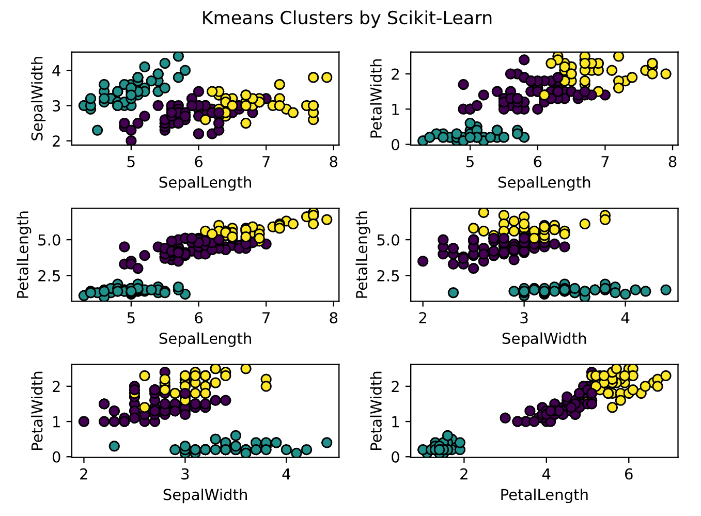

```{r setup, include=FALSE}
knitr::opts_chunk$set(echo = TRUE)

# julia engine
options(encoding = "UTF-8")
library(JuliaCall)
julia <- julia_setup()
```


I want to introduce you the <u>[ClusterAnalysis.jl](https://github.com/AugustoCL/ClusterAnalysis.jl)</u> package that [I](https://github.com/AugustoCL) and [eliascarv](https://github.com/eliascarv/) built from scratch using only the Julia Language. We implement [K-Means](https://en.wikipedia.org/wiki/K-means_clustering) and [DBSCAN](https://en.wikipedia.org/wiki/DBSCAN) clustering algorithms and achieved a performance superior to the same [Scikit-Learn](https://scikit-learn.org/stable/) algorithms.  

The package is mostly a learning experiment, but the package were also built and documented to be used by anyone, Plug-and-Play. Just input your data as an Array or a Tables.jl type (like DataFrames.jl), then start training your clusters algorithms and analyze your results.
&nbsp;

## A quick example
```{julia, eval=FALSE}
# load packages
using CSV, DataFrames
using StatsPlots
using ClusterAnalysis

# load data
df = CSV.read("algo_overview/blob_data.csv", DataFrame, drop=[1]);
X = df[:,1:2];
y = df[:,end];

# dbscan model
ϵ = 0.35;
min_pts = 10;
m = dbscan(X, ϵ, min_pts);

# plot 
gr(size=(1000,600))
p1 = scatter(X[:,1], X[:,2], group=y, 
            leg=false,
            ms=6, 
            title="True clusters");
p2 = scatter(X[:,1], X[:,2], zcolor=m.labels, 
            leg=false, 
            ms=6,
            title="DBSCAN prediction\n(ϵ=$(ϵ), minPts=$(min_pts))");
plot(p1, p2, layout=2)
```  
&nbsp;
  
&nbsp;

## Algorithm's Overview
[Here](https://github.com/AugustoCL/ClusterAnalysis.jl) is the repo in github, which includes a pkg intro and a section called "Algorithm's Overview" that succintly explains how each algorithm works. The Algorithm's Overview of [K-Means](https://github.com/AugustoCL/ClusterAnalysis.jl/blob/main/algo_overview/kmeans_overview.md), by example, has a lot of images, gifs and a pseudocode to help the user understand the source-code. 

> I really suggest you to read the Algorithm's Overview Section along with the source code for a better understanding of the algorithm.

&nbsp;

## Benchmark
This implementation has an excellent computational performance, being **faster than Scikit-Learn's** KMeans and DBSCAN.

Here is an example with **K-Means**, but we also have the same benchmark in DBSCAN overview section.

**Scikit-Learn with C in backend**


**ClusterAnalysis.jl in Pure Julia**


Here is another plot comparing results from Julia to SKlearn. 



&nbsp;

In the **next posts** I will detail K-Means and DBSCAN algorithms produced in this package, explaining all the logic used in the construction of the source code. For now, check the Algorithm's Overview and use the package in your clusters analysis. If you have any suggestion about the pkg, feel free to contact me in github.

To install the package just type  
```{julia, eval=FALSE}
julia> ]        # press ] to enter in Pkg REPL mode.
pkg> add https://github.com/AugustoCL/ClusterAnalysis.jl
```

