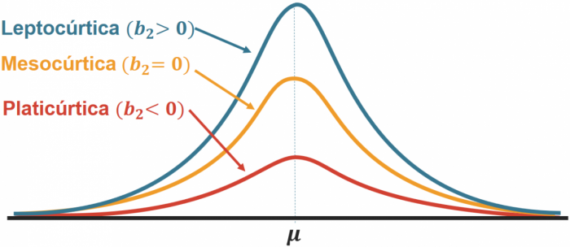

Esse projeto é um ___<u>[dashboard interativo](https://augustoleal.shinyapps.io/Portf_Analysis_ACL/)</u>___ onde é possível analisar um portfólio de até 5 ativos, a partir de 4 visões (**retorno**, **desvio padrão**, **assimetria** e **curtose**).

---

### ___<u>[Dashboard](https://augustoleal.shinyapps.io/Portf_Analysis_ACL/)</u>___
<iframe width="666" height="360" src="https://www.youtube.com/embed/iLZoYiBmzDE" frameborder="0" allow="accelerometer; autoplay; clipboard-write; encrypted-media; gyroscope; picture-in-picture" allowfullscreen></iframe>
---

 Todo o dashboard foi construído com a linguagem R, usando as ferramentas: \
- **Shiny** (Reatividade do Dashboard) \
- **Flexdashboard** (Template Rápido de Dashboards) \
- **Highcharter** (Visualização Gráfica em JavaScript) \
- **Tidyquant** (Pacote R que traz dados do *Yahoo Finance*)

Objetivo do projeto foi gerar conjunto de visualizações relevantes para uma análise descritiva de um portfólio, utilizando os conhecimentos aprendidos no livro ___<u>[Reproducible Finance with R](http://www.reproduciblefinance.com/)</u>___. 
Como esta é uma aplicação dos conhecimentos do livro, sinta-se a vontade para utilizá-la como complemento ao conteúdo do livro e seus estudos pessoais. 

Aproveite a interatividade dos gráficos no dashboard e experimente os filtros de tempo, gráficos reativos e outras funcionalidades que o ___<u>[Highcharter](http://jkunst.com/highcharter/)</u>___ disponibiliza para aperfeiçoar a sua análise.  

O código inteiro do projeto está disponível neste ___<u>[link](https://github.com/AugustoCL/DashPortfolio)</u>___ do Github.

---

### INPUTS
**TICKER**: Como o dash se alimenta com dados do ___<u>[Yahoo Finance](https://finance.yahoo.com/)</u>___, todos os ativos da plataforma podem ser adicionados ao dashboard e, portanto, devem cumprir o padrão de ticker do mesmo.

Ação Brasileira | Ação Americana
--------------- | ----------------
**WEGE3\.SA** (WEG) | **SBUX** (Starbucks)

Em caso de dúvidas do ticker correto, acesse o ___<u>[Yahoo Finance](https://finance.yahoo.com/)</u>___ para a captura dos ativos desejados.

**PESOS**: Certifique-se de que os pesos somem 100% para que os cálculos do dashboard sejam efetuados. Para isso, o botão 'Calcular' fica disponível somente quando os pesos somam 100%.

**DATAS**: Quando selecionar as datas de início e fim de análise, atente-se para que todas as 5 ações estejam disponíveis neste período. Caso alguma cia não esteja disponível no intervalo os cálculos do portfólio irão quebrar. --> (*Este caso está incluso na lista de melhorias abaixo*)

**PERIODICIDADE e JANELA MÓVEL**: Utilize estas opções para detalhar sua análise. Os log-retornos serão analisados de acordo com a periodicidade selecionada (anual, mensal e semanal) e a janela móvel te permite observar o comportamento histórico de medidas de risco do portfólio, como desvio padrão, assimetria e curtose. 

### Resumo das 4 visões
**Log-Retornos**: Para avaliarmos as distribuições históricas dos retornos, é necessário utilizar o `log-retorno` para equalizar os pesos para os retornos reais positivos e negativos. Acesse esse ___<u>[link](http://ferramentasdoinvestidor.com.br/dicas-de-excel/entenda-o-log-retorno/)</u>___ para uma maior compreensão do uso necessário do log-retorno na avaliação de retornos acumulados.  

**Desvio Padrão**: Indica o grau de dispersão dos log-retornos dos ativos em relação a sua média. Quanto maior o desvio padrão, mais volátil (risco) é o log-retorno do ativo.

**Assimetria**: Descrever o comportamento histórico dos retornos através da assimetria de sua distribuição em relação a média. Como a média dos log-retornos tendem a zero, assimetria negativa indica forte presença de retornos positivos, enquanto assimetria positiva indica grandes retorno negativos. 

**Curtose**: Descreve a intensidade de valores extremos na distribuição de retornos. Curtose baixa significa uma grande quantidade de retornos extremos no histórico do ativo e curtose alta há pouca quantidade de retornos extremos.

Obs.: Ilustrações retiradas do ___<u>[Portal Action](http://www.portalaction.com.br/)</u>___

### Lista de Melhorias
- [ ] Permitir o input de 4 ativos ou menos no portfólio.
- [ ] Permitir o input 5 ativos ou mais no portfólio.
- [ ] Permitir o cálculo do portfólio em intervalos de tempo que algum  ativo não esteja disponível.
- [ ] Adicionar novas páginas contendo CAPM, Sharpe Ratio e Frama-French Model
- [ ] Refazer o Dashboard utilizando **Shiny** ou **Shinydashboard**.
- [ ] Modularizar o dash para organizar o script, com um módulo para cada página.
- [ ] Construir o app usando **Golem** para colocar o app em produção utilizando um container (**docker**)  em alguma nuvem na web. 

Obs.: A sequência das melhorias não indica ordem de prioridades.